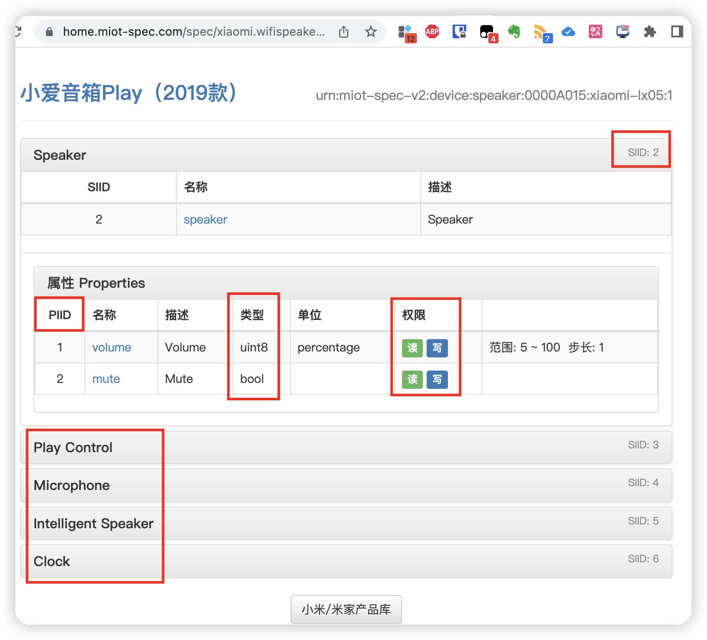
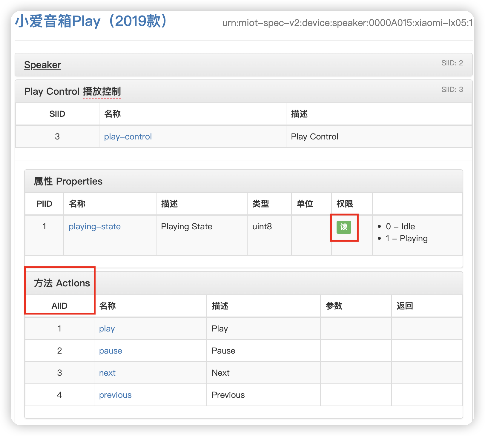
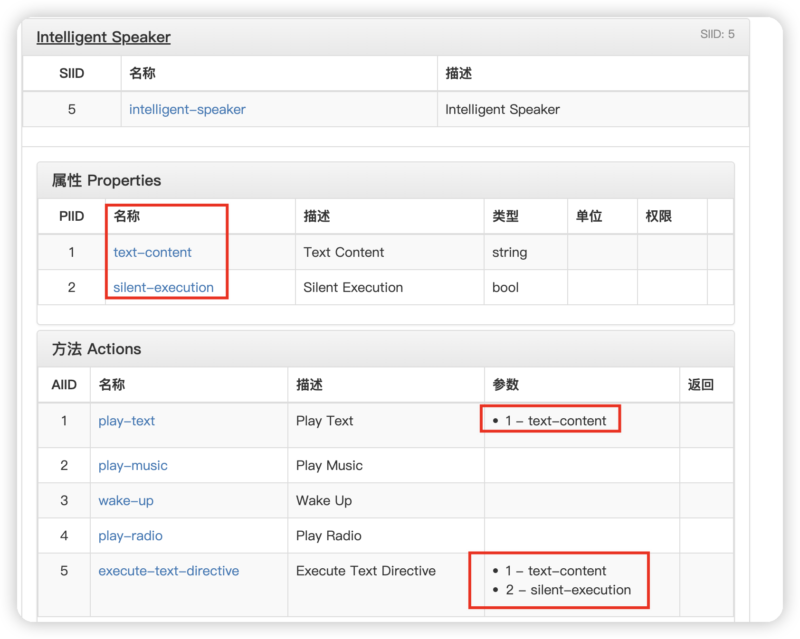

## 概述

通过前面一篇博客[小米音响接入ChatGPT](/2023/09/23/xiaomi-speaker-chatgpt/index.html)感觉突然打开了小米智能家居的一扇大门，于是自行探索了一下用命令行去下发指令操作小米音响，也汇总一下尝试出来的命令和参数，MiService项目文档中其实写的很清楚了，只是不熟悉的容易懵，我来举一些示例说明就比较容易理解。**注意：下文中AAAAA均表示设备的DID，请同micli list获取实际DID替换**

## 获取设备物模型

可以通过命令行也可以查询网站：[https://home.miot-spec.com/](https://home.miot-spec.com/)，这个更容易看懂建议从这里搜索到之后点击模型名调到物模型详情。

下面看命令行输出，做了部分注释

```
micli spec xiaomi.wifispeaker.lx05
# Generated by https://github.com/Yonsm/MiService
# http://miot-spec.org/miot-spec-v2/instance?type=urn:miot-spec-v2:device:speaker:0000A015:xiaomi-lx05:1

Device_Information = 1
    Device_Manufacturer = 1
    Device_Model = 2
    Device_Serial_Number = 3
    Current_Firmware_Version = 4

Speaker = 2
    Volume = 1  # uint8  # rw   ##rw表示可读可写
    Mute = 2  # bool  # rw

Play_Control = 3               ## 第一层是siid
    Playing_State = 1  # uint8 ## 第二层是piid

    _Play = 1                  ## 第三层是aiid
    _Pause = 2
    _Next = 3
    _Previous = 4

Microphone = 4
    Mute = 1  # bool  # rw

Intelligent_Speaker = 5
    _Text_Content = 1
    _Silent_Execution = 2  # bool

    _Play_Text = 1  # in=[1]
    _Play_Music = 2
    _Wake_Up = 3
    _Play_Radio = 4
    _Execute_Text_Directive = 5  # in=[1, 2]

Clock = 6

    _Stop_Alarm = 1

Speaker_Volume
    MIN = 5
    MAX = 100

Play_Control_Playing_State
    Idle = 0
    Playing = 1
```

**说明**：

- 物模型分三层，上面已经做了注释说明
- 下发指令时sid是必填的，pid默认为1，可不填，aid默认也为1
- bool表示这个指令后面跟的是布尔类型
- in=表示执行这个指令还需要参数，列表有几个就需要几个参数
- 从网站上查询的会更容易读，见下图



## 音箱操作示例

从上面的物模型来看，音箱支持的操作有扬声器控制、播放控制、麦克风控制、智能语音和闹钟控制几个大的部分，都类似的，下面以扬声器、播放和智能语音来简单举例

### 扬声器控制

从前面的一幅图可以看到，对于扬声器，SIID是2，支持音量和开关设置，前者PIID是1，类型是整数，有值范围（物模型uint8），后者PIID是2，类型是布尔型（bool）

```
# 读取音量
root@dsm:~# micli 2-1   #命令等效于micli 2，piid默认为1可以省略
[
  18
]
# 设置音量，依据物模型，值是5到100之间的整数
# 设置是生效后马上读取音量值时返回不一定正确，需要等一等
root@dsm:~# micli 2-1=#35    ## 命令等效于 micli 2=#10
[
  0
]
root@dsm:~# micli 2=#120
[
  -704220043   ## 命令执行出错
]
# 停止播放，
root@dsm:~# micli 2-2=true
[
  0
]
# 是否在播放
root@dsm:~# micli 2-2
[
  false  #表示播放中，true表示停止，前面提到的mute_xiaoai可能是通过这个判断
]
```

### 播放控制

物模型如下，终于有aiid出现了，这里的piid只能读也是获取当前播放状态的



示例：

```
# 获取当前播放状态
root@dsm:~# micli 3  #  micli 3-1  一样
[
  1  #播放中
]
# 对于有aiid的，需要换一种命令下发模式了,这里的action没有任何参数
root@dsm:~# micli action '{"did":"AAAAA","siid":3,"aiid":1}'  # 这里的1表示播放，其他值的意义见上图说明
{
  "did": "AAAAA",
  "miid": 0,
  "siid": 3,
  "aiid": 1,
  "code": 0,  # 0表示正确成功执行
  "exe_time": 22,
  "net_cost": 68,
  "ot_cost": 19,
  "otlocalts": 1695487574206809,
  "oa_cost": -1,
  "_oa_rpc_cost": 112,
  "withLatency": 0
}
## 下一首
root@dsm:~# micli action '{"did":"AAAAA","siid":3,"aiid":4}'
{
  "did": "AAAAA",
  "miid": 0,
  "siid": 3,
  "aiid": 4,
  "code": 0,
...
}
```

### 智能语音---执行文本

这里的action里面就是带参数的。



```
# 播放文本，play-text只有一个参数
root@dsm:~# micli action '{"did":"AAAAA","siid":5,"aiid":1,"in":["回家吃饭"]}' ##等效于 micli 5-1 回家吃饭
{
  "did": "AAAAA",
  "miid": 0,
  "siid": 5,
  "aiid": 1,
  "code": 0,
....
}
# 播放音乐，感觉等效于直接呼他播放音乐
micli action '{"did":"AAAAA","siid":5,"aiid":2}'
{
  "did": "AAAAA",
  "miid": 0,
  "siid": 5,
  "aiid": 2,
  "code": 0,
...
}
# 交互语音，这里以’请回答‘开头，会发给ChatGPT来再次回答，两个参数，第一个是提问，第二个是执行模式
root@dsm:~# micli action '{"did":"AAAAA","siid":5,"aiid":5,"in":["请回答今天天气如何","false"]}'
{
  "did": "AAAAA",
  "miid": 0,
  "siid": 5,
  "aiid": 5,
  "code": 0,
...
}
# 不需要ChatGPT参与的问天气
root@dsm:~# micli action '{"did":"AAAAA","siid":5,"aiid":5,"in":["查询天气","true"]}'
{
  "did": "AAAAA",
  "miid": 0,
  "siid": 5,
  "aiid": 5,
  "code": 0,
...
}
# 下面命令等效于下面的
root@dsm:~# micli 5-5 查询天气 true
0
```


### 总结

从物模型里面可以清晰知道如何执行指令，类似与接口了，还是比较容易理解的。

